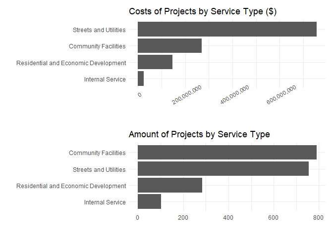

```r
library(tidyverse)     # for data cleaning and plotting
library(gardenR)       # for Lisa's garden data
library(lubridate)     # for date manipulation
library(openintro)     # for the abbr2state() function
library(palmerpenguins)# for Palmer penguin data
library(maps)          # for map data
library(ggmap)         # for mapping points on maps
library(gplots)        # for col2hex() function
library(RColorBrewer)  # for color palettes
library(sf)            # for working with spatial data
library(leaflet)       # for highly customizable mapping
library(ggthemes)      # for more themes (including theme_map())
library(plotly)        # for the ggplotly() - basic interactivity
library(gganimate)     # for adding animation layers to ggplots
library(gifski)        # for creating the gif (don't need to load this library every time,but need it installed)
library(transformr)    # for "tweening" (gganimate)
library(shiny)         # for creating interactive apps
library(patchwork)     # for nicely combining ggplot2 graphs  
library(gt)            # for creating nice tables
library(rvest)         # for scraping data
library(robotstxt)     # for checking if you can scrape data
theme_set(theme_minimal())
```


```r
# Lisa's garden data
data("garden_harvest")

#COVID-19 data from the New York Times
covid19 <- read_csv("https://raw.githubusercontent.com/nytimes/covid-19-data/master/us-states.csv")
```

## Put your homework on GitHub!

Go [here](https://github.com/llendway/github_for_collaboration/blob/master/github_for_collaboration.md) or to previous homework to remind yourself how to get set up. 

Once your repository is created, you should always open your **project** rather than just opening an .Rmd file. You can do that by either clicking on the .Rproj file in your repository folder on your computer. Or, by going to the upper right hand corner in R Studio and clicking the arrow next to where it says Project: (None). You should see your project come up in that list if you've used it recently. You could also go to File --> Open Project and navigate to your .Rproj file. 

## Instructions

* Put your name at the top of the document. 

* **For ALL graphs, you should include appropriate labels.** 

* Feel free to change the default theme, which I currently have set to `theme_minimal()`. 

* Use good coding practice. Read the short sections on good code with [pipes](https://style.tidyverse.org/pipes.html) and [ggplot2](https://style.tidyverse.org/ggplot2.html). **This is part of your grade!**

* **NEW!!** With animated graphs, add `eval=FALSE` to the code chunk that creates the animation and saves it using `anim_save()`. Add another code chunk to reread the gif back into the file. See the [tutorial](https://animation-and-interactivity-in-r.netlify.app/) for help. 

* When you are finished with ALL the exercises, uncomment the options at the top so your document looks nicer. Don't do it before then, or else you might miss some important warnings and messages.

## Your first `shiny` app 

  1. This app will also use the COVID data. Make sure you load that data and all the libraries you need in the `app.R` file you create. Below, you will post a link to the app that you publish on shinyapps.io. You will create an app to compare states' cumulative number of COVID cases over time. The x-axis will be number of days since 20+ cases and the y-axis will be cumulative cases on the log scale (`scale_y_log10()`). We use number of days since 20+ cases on the x-axis so we can make better comparisons of the curve trajectories. You will have an input box where the user can choose which states to compare (`selectInput()`) and have a submit button to click once the user has chosen all states they're interested in comparing. The graph should display a different line for each state, with labels either on the graph or in a legend. Color can be used if needed. 
  
  [Link](https://jfortin116.shinyapps.io/Covid_cases_app/)
  
## Warm-up exercises from tutorial

  2. Read in the fake garden harvest data. Find the data [here](https://github.com/llendway/scraping_etc/blob/main/2020_harvest.csv) and click on the `Raw` button to get a direct link to the data. 
  

```r
X2020_harvest <- read_csv("2020_harvest.csv", 
    col_types = cols(weight = col_number()), 
    na = "null", skip = 2)
View(X2020_harvest)
```
  
  
  3. Read in this [data](https://www.kaggle.com/heeraldedhia/groceries-dataset) from the kaggle website. You will need to download the data first. Save it to your project/repo folder. Do some quick checks of the data to assure it has been read in appropriately.


```r
Groceries_dataset <- read_csv("kaggle/Groceries_dataset.csv")
View(Groceries_dataset)

Groceries_dataset %>% 
  mutate(across(where(is.character), as.factor)) %>% 
  summary()
```

```
##  Member_number          Date               itemDescription 
##  Min.   :1000   21-01-2015:   96   whole milk      : 2502  
##  1st Qu.:2002   21-07-2015:   93   other vegetables: 1898  
##  Median :3005   08-08-2015:   92   rolls/buns      : 1716  
##  Mean   :3004   29-11-2015:   92   soda            : 1514  
##  3rd Qu.:4007   30-04-2015:   91   yogurt          : 1334  
##  Max.   :5000   26-03-2015:   88   root vegetables : 1071  
##                 (Other)   :38213   (Other)         :28730
```


  4. CHALLENGE(not graded): Write code to replicate the table shown below (open the .html file to see it) created from the `garden_harvest` data as best as you can. When you get to coloring the cells, I used the following line of code for the `colors` argument:
  

```r
colors = scales::col_numeric(
      palette = paletteer::paletteer_d(
        palette = "RColorBrewer::YlGn"
      ) %>% as.character()
```

  5. Create a table using `gt` with data from your project or from the `garden_harvest` data if your project data aren't ready.
  

```r
Capital_Improvement_Budgets <- read_csv("Adopted_Capital_Improvement_Budgets_-_Dataset.csv")
```
  

```r
Capital_Improvement_Budgets %>% 
  mutate(across(where(is.character), as.factor)) %>% 
  summary()
```

```
##       YEAR                                      SERVICE   
##  Min.   :2004   Community Facilities                :790  
##  1st Qu.:2008   Internal Service                    :103  
##  Median :2012   Residential and Economic Development:283  
##  Mean   :2012   Streets and Utilities               :755  
##  3rd Qu.:2016                                             
##  Max.   :2021                                             
##                                                           
##                                                  TITLE               ID #     
##  Sidewalk Reconstruction Program                    :  45   SU-660821-1:  35  
##  Children's Play Area Improvements                  :  30   CF-660834  :  30  
##  Parks Grant Prep/Preliminary Design Program        :  30   CF-661054  :  30  
##  Bond Sale Costs                                    :  26   SU-662231  :  28  
##  Outdoor Court Restoration Program                  :  25   CF-660833  :  25  
##  Signalized Intersection Safety Improvements Program:  23   CF-660692-1:  24  
##  (Other)                                            :1752   (Other)    :1759  
##                              DEPARTMENT                   LOCATION   
##  Public Works                     :779   Citywide             : 613  
##  Parks and Recreation             :569   Internal Accounting  :  68  
##  Planning and Economic Development:271   1225 Estabrook Drive :  33  
##  General Government               : 94   Downtown area        :  16  
##  Police                           : 48   1325 Aida Place      :  15  
##  Fire                             : 45   891 North Dale Street:  14  
##  (Other)                          :125   (Other)              :1172  
##      DISTRICT  
##  Citywide:743  
##  0       :280  
##  5       : 83  
##  6       : 67  
##  17      : 57  
##  3       : 45  
##  (Other) :656  
##                                                                                                                                                                                                                                                                                                                                                                                                                                                                                                                                                                                                                                                                                                                                                                                                                                                                                                          Description  
##  A specified fund for Capital Maintenance work on City-owned facilities. This program funds the preservation of the City's physical assets.                                                                                                                                                                                                                                                                                                                                                                                                                                                                                                                                                                                                                                                                                                                                                                    : 459  
##  This is a citywide program established to improve the structural condition, safety and rideability of the city's street system.  This recurring program, which replaces the Residential Street Vitality Program, will include all city streets, both residential and arterial, and projects will be prioritized by Pavement Condition Index and Average Daily Traffic as the main criteria.                                                                                                                                                                                                                                                                                                                                                                                                                                                                                                                   :  58  
##  Based on the work of Gil Penalosa, an internationally renowned urban designer, this fund will allow the building of bold and vibrant places across the City of Saint Paul.  The 8-80 Vitality Fund will build on the momentum of recent investments such as Rebuild Saint Paul and the Green Line.  An 8-80 city works for people aged 8 and aged 80, by providing streets and public spaces that create vital and welcoming neighborhoods.\n\nInvestments include:\n$8M - Palace Theatre renovations to match State bonding\n$8M - Jackson Street reconstruction and phase 1 of downtown bike loop\n$13.2M - Grand Rounds, including street reconstruction and bike lanes\n$2M - Dickerman Park, developing green spaces on the Green Line\n$1.8M - Optical fiber infrastructure to provide high speed citywide network connectivity\n$9.5M - Street Reconstruction, including 8-80 streets and public spaces:  37  
##  Reconstruct hazardous and deteriorating sidewalks throughout the City.  The work locations are prioritized so as to correct most severe areas first.                                                                                                                                                                                                                                                                                                                                                                                                                                                                                                                                                                                                                                                                                                                                                          :  35  
##  Continuation of an annual program which facilitates the systematic replacement, renovation, and/or retrofitting of the City's existing children's play areas based on the Parks Asset Management System, the Parks and Recreation Vision and System Plan and other factors.                                                                                                                                                                                                                                                                                                                                                                                                                                                                                                                                                                                                                                   :  30  
##  To set aside a portion of the Capital Improvement Bond proceeds to cover the cost of issuing the bonds.                                                                                                                                                                                                                                                                                                                                                                                                                                                                                                                                                                                                                                                                                                                                                                                                       :  28  
##  (Other)                                                                                                                                                                                                                                                                                                                                                                                                                                                                                                                                                                                                                                                                                                                                                                                                                                                                                                       :1284  
##          FIN_CODE       Amount            LATITUDE       LONGITUDE     
##  CIB         :881   Min.   :    3300   Min.   : 0.00   Min.   :-93.20  
##  CDBG        :293   1st Qu.:   50000   1st Qu.: 0.00   1st Qu.:  0.00  
##  MSA         :217   Median :  165000   Median : 0.00   Median :  0.00  
##  Assessment  : 85   Mean   :  619176   Mean   : 8.59   Mean   :-17.79  
##  Street Bonds: 52   3rd Qu.:  467500   3rd Qu.: 0.00   3rd Qu.:  0.00  
##  PIA         : 38   Max.   :25000000   Max.   :45.00   Max.   :  0.00  
##  (Other)     :365                      NA's   :73      NA's   :73
```
  

```r
table1 <- Capital_Improvement_Budgets %>% 
  group_by(YEAR, DEPARTMENT) %>% 
  summarize(sum_amount = sum(Amount)) %>% 
  gt() %>% 
  tab_header(title = "City of Saint Paul Adopted Capital Improvement Budgets",
             subtitle = "2004 - 2021") %>% 
  fmt_currency(columns = "sum_amount",
               currency = "USD") %>% 
  cols_label(DEPARTMENT = "Department",
             sum_amount = "Total Amount Spent on Projects")

table1
```

<!--html_preserve--><style>html {
  font-family: -apple-system, BlinkMacSystemFont, 'Segoe UI', Roboto, Oxygen, Ubuntu, Cantarell, 'Helvetica Neue', 'Fira Sans', 'Droid Sans', Arial, sans-serif;
}

#rqdkbdkayr .gt_table {
  display: table;
  border-collapse: collapse;
  margin-left: auto;
  margin-right: auto;
  color: #333333;
  font-size: 16px;
  font-weight: normal;
  font-style: normal;
  background-color: #FFFFFF;
  width: auto;
  border-top-style: solid;
  border-top-width: 2px;
  border-top-color: #A8A8A8;
  border-right-style: none;
  border-right-width: 2px;
  border-right-color: #D3D3D3;
  border-bottom-style: solid;
  border-bottom-width: 2px;
  border-bottom-color: #A8A8A8;
  border-left-style: none;
  border-left-width: 2px;
  border-left-color: #D3D3D3;
}

#rqdkbdkayr .gt_heading {
  background-color: #FFFFFF;
  text-align: center;
  border-bottom-color: #FFFFFF;
  border-left-style: none;
  border-left-width: 1px;
  border-left-color: #D3D3D3;
  border-right-style: none;
  border-right-width: 1px;
  border-right-color: #D3D3D3;
}

#rqdkbdkayr .gt_title {
  color: #333333;
  font-size: 125%;
  font-weight: initial;
  padding-top: 4px;
  padding-bottom: 4px;
  border-bottom-color: #FFFFFF;
  border-bottom-width: 0;
}

#rqdkbdkayr .gt_subtitle {
  color: #333333;
  font-size: 85%;
  font-weight: initial;
  padding-top: 0;
  padding-bottom: 4px;
  border-top-color: #FFFFFF;
  border-top-width: 0;
}

#rqdkbdkayr .gt_bottom_border {
  border-bottom-style: solid;
  border-bottom-width: 2px;
  border-bottom-color: #D3D3D3;
}

#rqdkbdkayr .gt_col_headings {
  border-top-style: solid;
  border-top-width: 2px;
  border-top-color: #D3D3D3;
  border-bottom-style: solid;
  border-bottom-width: 2px;
  border-bottom-color: #D3D3D3;
  border-left-style: none;
  border-left-width: 1px;
  border-left-color: #D3D3D3;
  border-right-style: none;
  border-right-width: 1px;
  border-right-color: #D3D3D3;
}

#rqdkbdkayr .gt_col_heading {
  color: #333333;
  background-color: #FFFFFF;
  font-size: 100%;
  font-weight: normal;
  text-transform: inherit;
  border-left-style: none;
  border-left-width: 1px;
  border-left-color: #D3D3D3;
  border-right-style: none;
  border-right-width: 1px;
  border-right-color: #D3D3D3;
  vertical-align: bottom;
  padding-top: 5px;
  padding-bottom: 6px;
  padding-left: 5px;
  padding-right: 5px;
  overflow-x: hidden;
}

#rqdkbdkayr .gt_column_spanner_outer {
  color: #333333;
  background-color: #FFFFFF;
  font-size: 100%;
  font-weight: normal;
  text-transform: inherit;
  padding-top: 0;
  padding-bottom: 0;
  padding-left: 4px;
  padding-right: 4px;
}

#rqdkbdkayr .gt_column_spanner_outer:first-child {
  padding-left: 0;
}

#rqdkbdkayr .gt_column_spanner_outer:last-child {
  padding-right: 0;
}

#rqdkbdkayr .gt_column_spanner {
  border-bottom-style: solid;
  border-bottom-width: 2px;
  border-bottom-color: #D3D3D3;
  vertical-align: bottom;
  padding-top: 5px;
  padding-bottom: 6px;
  overflow-x: hidden;
  display: inline-block;
  width: 100%;
}

#rqdkbdkayr .gt_group_heading {
  padding: 8px;
  color: #333333;
  background-color: #FFFFFF;
  font-size: 100%;
  font-weight: initial;
  text-transform: inherit;
  border-top-style: solid;
  border-top-width: 2px;
  border-top-color: #D3D3D3;
  border-bottom-style: solid;
  border-bottom-width: 2px;
  border-bottom-color: #D3D3D3;
  border-left-style: none;
  border-left-width: 1px;
  border-left-color: #D3D3D3;
  border-right-style: none;
  border-right-width: 1px;
  border-right-color: #D3D3D3;
  vertical-align: middle;
}

#rqdkbdkayr .gt_empty_group_heading {
  padding: 0.5px;
  color: #333333;
  background-color: #FFFFFF;
  font-size: 100%;
  font-weight: initial;
  border-top-style: solid;
  border-top-width: 2px;
  border-top-color: #D3D3D3;
  border-bottom-style: solid;
  border-bottom-width: 2px;
  border-bottom-color: #D3D3D3;
  vertical-align: middle;
}

#rqdkbdkayr .gt_from_md > :first-child {
  margin-top: 0;
}

#rqdkbdkayr .gt_from_md > :last-child {
  margin-bottom: 0;
}

#rqdkbdkayr .gt_row {
  padding-top: 8px;
  padding-bottom: 8px;
  padding-left: 5px;
  padding-right: 5px;
  margin: 10px;
  border-top-style: solid;
  border-top-width: 1px;
  border-top-color: #D3D3D3;
  border-left-style: none;
  border-left-width: 1px;
  border-left-color: #D3D3D3;
  border-right-style: none;
  border-right-width: 1px;
  border-right-color: #D3D3D3;
  vertical-align: middle;
  overflow-x: hidden;
}

#rqdkbdkayr .gt_stub {
  color: #333333;
  background-color: #FFFFFF;
  font-size: 100%;
  font-weight: initial;
  text-transform: inherit;
  border-right-style: solid;
  border-right-width: 2px;
  border-right-color: #D3D3D3;
  padding-left: 12px;
}

#rqdkbdkayr .gt_summary_row {
  color: #333333;
  background-color: #FFFFFF;
  text-transform: inherit;
  padding-top: 8px;
  padding-bottom: 8px;
  padding-left: 5px;
  padding-right: 5px;
}

#rqdkbdkayr .gt_first_summary_row {
  padding-top: 8px;
  padding-bottom: 8px;
  padding-left: 5px;
  padding-right: 5px;
  border-top-style: solid;
  border-top-width: 2px;
  border-top-color: #D3D3D3;
}

#rqdkbdkayr .gt_grand_summary_row {
  color: #333333;
  background-color: #FFFFFF;
  text-transform: inherit;
  padding-top: 8px;
  padding-bottom: 8px;
  padding-left: 5px;
  padding-right: 5px;
}

#rqdkbdkayr .gt_first_grand_summary_row {
  padding-top: 8px;
  padding-bottom: 8px;
  padding-left: 5px;
  padding-right: 5px;
  border-top-style: double;
  border-top-width: 6px;
  border-top-color: #D3D3D3;
}

#rqdkbdkayr .gt_striped {
  background-color: rgba(128, 128, 128, 0.05);
}

#rqdkbdkayr .gt_table_body {
  border-top-style: solid;
  border-top-width: 2px;
  border-top-color: #D3D3D3;
  border-bottom-style: solid;
  border-bottom-width: 2px;
  border-bottom-color: #D3D3D3;
}

#rqdkbdkayr .gt_footnotes {
  color: #333333;
  background-color: #FFFFFF;
  border-bottom-style: none;
  border-bottom-width: 2px;
  border-bottom-color: #D3D3D3;
  border-left-style: none;
  border-left-width: 2px;
  border-left-color: #D3D3D3;
  border-right-style: none;
  border-right-width: 2px;
  border-right-color: #D3D3D3;
}

#rqdkbdkayr .gt_footnote {
  margin: 0px;
  font-size: 90%;
  padding: 4px;
}

#rqdkbdkayr .gt_sourcenotes {
  color: #333333;
  background-color: #FFFFFF;
  border-bottom-style: none;
  border-bottom-width: 2px;
  border-bottom-color: #D3D3D3;
  border-left-style: none;
  border-left-width: 2px;
  border-left-color: #D3D3D3;
  border-right-style: none;
  border-right-width: 2px;
  border-right-color: #D3D3D3;
}

#rqdkbdkayr .gt_sourcenote {
  font-size: 90%;
  padding: 4px;
}

#rqdkbdkayr .gt_left {
  text-align: left;
}

#rqdkbdkayr .gt_center {
  text-align: center;
}

#rqdkbdkayr .gt_right {
  text-align: right;
  font-variant-numeric: tabular-nums;
}

#rqdkbdkayr .gt_font_normal {
  font-weight: normal;
}

#rqdkbdkayr .gt_font_bold {
  font-weight: bold;
}

#rqdkbdkayr .gt_font_italic {
  font-style: italic;
}

#rqdkbdkayr .gt_super {
  font-size: 65%;
}

#rqdkbdkayr .gt_footnote_marks {
  font-style: italic;
  font-size: 65%;
}
</style>
<div id="rqdkbdkayr" style="overflow-x:auto;overflow-y:auto;width:auto;height:auto;"><table class="gt_table">
  <thead class="gt_header">
    <tr>
      <th colspan="2" class="gt_heading gt_title gt_font_normal" style>City of Saint Paul Adopted Capital Improvement Budgets</th>
    </tr>
    <tr>
      <th colspan="2" class="gt_heading gt_subtitle gt_font_normal gt_bottom_border" style>2004 - 2021</th>
    </tr>
  </thead>
  <thead class="gt_col_headings">
    <tr>
      <th class="gt_col_heading gt_columns_bottom_border gt_left" rowspan="1" colspan="1">Department</th>
      <th class="gt_col_heading gt_columns_bottom_border gt_right" rowspan="1" colspan="1">Total Amount Spent on Projects</th>
    </tr>
  </thead>
  <tbody class="gt_table_body">
    <tr class="gt_group_heading_row">
      <td colspan="2" class="gt_group_heading">2004</td>
    </tr>
    <tr>
      <td class="gt_row gt_left">Fire</td>
      <td class="gt_row gt_right">$127,570.00</td>
    </tr>
    <tr>
      <td class="gt_row gt_left">General Government</td>
      <td class="gt_row gt_right">$1,445,529.00</td>
    </tr>
    <tr>
      <td class="gt_row gt_left">Library</td>
      <td class="gt_row gt_right">$163,000.00</td>
    </tr>
    <tr>
      <td class="gt_row gt_left">Parks and Recreation</td>
      <td class="gt_row gt_right">$17,650,400.00</td>
    </tr>
    <tr>
      <td class="gt_row gt_left">Planning and Economic Development</td>
      <td class="gt_row gt_right">$17,050,000.00</td>
    </tr>
    <tr>
      <td class="gt_row gt_left">Police</td>
      <td class="gt_row gt_right">$19,800.00</td>
    </tr>
    <tr>
      <td class="gt_row gt_left">Public Works</td>
      <td class="gt_row gt_right">$39,157,000.00</td>
    </tr>
    <tr>
      <td class="gt_row gt_left">Safety and Inspections</td>
      <td class="gt_row gt_right">$200,000.00</td>
    </tr>
    <tr class="gt_group_heading_row">
      <td colspan="2" class="gt_group_heading">2005</td>
    </tr>
    <tr>
      <td class="gt_row gt_left">Financial Services</td>
      <td class="gt_row gt_right">$30,000.00</td>
    </tr>
    <tr>
      <td class="gt_row gt_left">Fire</td>
      <td class="gt_row gt_right">$3,735,925.00</td>
    </tr>
    <tr>
      <td class="gt_row gt_left">General Government</td>
      <td class="gt_row gt_right">$2,016,455.00</td>
    </tr>
    <tr>
      <td class="gt_row gt_left">Library</td>
      <td class="gt_row gt_right">$197,500.00</td>
    </tr>
    <tr>
      <td class="gt_row gt_left">Parks and Recreation</td>
      <td class="gt_row gt_right">$5,428,400.00</td>
    </tr>
    <tr>
      <td class="gt_row gt_left">Planning and Economic Development</td>
      <td class="gt_row gt_right">$15,950,000.00</td>
    </tr>
    <tr>
      <td class="gt_row gt_left">Police</td>
      <td class="gt_row gt_right">$21,720.00</td>
    </tr>
    <tr>
      <td class="gt_row gt_left">Public Works</td>
      <td class="gt_row gt_right">$52,681,000.00</td>
    </tr>
    <tr>
      <td class="gt_row gt_left">Safety and Inspections</td>
      <td class="gt_row gt_right">$200,000.00</td>
    </tr>
    <tr class="gt_group_heading_row">
      <td colspan="2" class="gt_group_heading">2006</td>
    </tr>
    <tr>
      <td class="gt_row gt_left">Financial Services</td>
      <td class="gt_row gt_right">$30,000.00</td>
    </tr>
    <tr>
      <td class="gt_row gt_left">Fire</td>
      <td class="gt_row gt_right">$660,392.00</td>
    </tr>
    <tr>
      <td class="gt_row gt_left">General Government</td>
      <td class="gt_row gt_right">$1,254,000.00</td>
    </tr>
    <tr>
      <td class="gt_row gt_left">Library</td>
      <td class="gt_row gt_right">$322,600.00</td>
    </tr>
    <tr>
      <td class="gt_row gt_left">Parks and Recreation</td>
      <td class="gt_row gt_right">$6,946,800.00</td>
    </tr>
    <tr>
      <td class="gt_row gt_left">Planning and Economic Development</td>
      <td class="gt_row gt_right">$32,125,000.00</td>
    </tr>
    <tr>
      <td class="gt_row gt_left">Police</td>
      <td class="gt_row gt_right">$1,961,000.00</td>
    </tr>
    <tr>
      <td class="gt_row gt_left">Public Works</td>
      <td class="gt_row gt_right">$35,351,000.00</td>
    </tr>
    <tr>
      <td class="gt_row gt_left">Safety and Inspections</td>
      <td class="gt_row gt_right">$200,000.00</td>
    </tr>
    <tr class="gt_group_heading_row">
      <td colspan="2" class="gt_group_heading">2007</td>
    </tr>
    <tr>
      <td class="gt_row gt_left">Financial Services</td>
      <td class="gt_row gt_right">$30,000.00</td>
    </tr>
    <tr>
      <td class="gt_row gt_left">Fire</td>
      <td class="gt_row gt_right">$207,853.00</td>
    </tr>
    <tr>
      <td class="gt_row gt_left">General Government</td>
      <td class="gt_row gt_right">$1,284,000.00</td>
    </tr>
    <tr>
      <td class="gt_row gt_left">Library</td>
      <td class="gt_row gt_right">$90,000.00</td>
    </tr>
    <tr>
      <td class="gt_row gt_left">Parks and Recreation</td>
      <td class="gt_row gt_right">$6,114,355.00</td>
    </tr>
    <tr>
      <td class="gt_row gt_left">Planning and Economic Development</td>
      <td class="gt_row gt_right">$6,194,000.00</td>
    </tr>
    <tr>
      <td class="gt_row gt_left">Police</td>
      <td class="gt_row gt_right">$10,515,000.00</td>
    </tr>
    <tr>
      <td class="gt_row gt_left">Public Works</td>
      <td class="gt_row gt_right">$40,112,000.00</td>
    </tr>
    <tr>
      <td class="gt_row gt_left">Safety and Inspections</td>
      <td class="gt_row gt_right">$200,000.00</td>
    </tr>
    <tr class="gt_group_heading_row">
      <td colspan="2" class="gt_group_heading">2008</td>
    </tr>
    <tr>
      <td class="gt_row gt_left">Financial Services</td>
      <td class="gt_row gt_right">$2,730,000.00</td>
    </tr>
    <tr>
      <td class="gt_row gt_left">Fire</td>
      <td class="gt_row gt_right">$1,030,800.00</td>
    </tr>
    <tr>
      <td class="gt_row gt_left">General Government</td>
      <td class="gt_row gt_right">$1,368,996.00</td>
    </tr>
    <tr>
      <td class="gt_row gt_left">Library</td>
      <td class="gt_row gt_right">$57,000.00</td>
    </tr>
    <tr>
      <td class="gt_row gt_left">Office of Technology</td>
      <td class="gt_row gt_right">$835,000.00</td>
    </tr>
    <tr>
      <td class="gt_row gt_left">Parks and Recreation</td>
      <td class="gt_row gt_right">$10,559,000.00</td>
    </tr>
    <tr>
      <td class="gt_row gt_left">Planning and Economic Development</td>
      <td class="gt_row gt_right">$4,637,000.00</td>
    </tr>
    <tr>
      <td class="gt_row gt_left">Police</td>
      <td class="gt_row gt_right">$350,000.00</td>
    </tr>
    <tr>
      <td class="gt_row gt_left">Public Works</td>
      <td class="gt_row gt_right">$41,322,000.00</td>
    </tr>
    <tr>
      <td class="gt_row gt_left">Safety and Inspections</td>
      <td class="gt_row gt_right">$832,204.00</td>
    </tr>
    <tr class="gt_group_heading_row">
      <td colspan="2" class="gt_group_heading">2009</td>
    </tr>
    <tr>
      <td class="gt_row gt_left">Financial Services</td>
      <td class="gt_row gt_right">$30,000.00</td>
    </tr>
    <tr>
      <td class="gt_row gt_left">Fire</td>
      <td class="gt_row gt_right">$17,845,270.00</td>
    </tr>
    <tr>
      <td class="gt_row gt_left">General Government</td>
      <td class="gt_row gt_right">$1,354,230.00</td>
    </tr>
    <tr>
      <td class="gt_row gt_left">Library</td>
      <td class="gt_row gt_right">$40,000.00</td>
    </tr>
    <tr>
      <td class="gt_row gt_left">Parks and Recreation</td>
      <td class="gt_row gt_right">$6,590,500.00</td>
    </tr>
    <tr>
      <td class="gt_row gt_left">Planning and Economic Development</td>
      <td class="gt_row gt_right">$4,974,000.00</td>
    </tr>
    <tr>
      <td class="gt_row gt_left">Police</td>
      <td class="gt_row gt_right">$911,000.00</td>
    </tr>
    <tr>
      <td class="gt_row gt_left">Public Works</td>
      <td class="gt_row gt_right">$38,652,000.00</td>
    </tr>
    <tr>
      <td class="gt_row gt_left">Safety and Inspections</td>
      <td class="gt_row gt_right">$500,000.00</td>
    </tr>
    <tr class="gt_group_heading_row">
      <td colspan="2" class="gt_group_heading">2010</td>
    </tr>
    <tr>
      <td class="gt_row gt_left">Financial Services</td>
      <td class="gt_row gt_right">$130,000.00</td>
    </tr>
    <tr>
      <td class="gt_row gt_left">Fire</td>
      <td class="gt_row gt_right">$66,500.00</td>
    </tr>
    <tr>
      <td class="gt_row gt_left">General Government</td>
      <td class="gt_row gt_right">$793,193.00</td>
    </tr>
    <tr>
      <td class="gt_row gt_left">Library</td>
      <td class="gt_row gt_right">$3,485,000.00</td>
    </tr>
    <tr>
      <td class="gt_row gt_left">Office of Technology</td>
      <td class="gt_row gt_right">$60,000.00</td>
    </tr>
    <tr>
      <td class="gt_row gt_left">Parks and Recreation</td>
      <td class="gt_row gt_right">$28,645,000.00</td>
    </tr>
    <tr>
      <td class="gt_row gt_left">Planning and Economic Development</td>
      <td class="gt_row gt_right">$4,634,000.00</td>
    </tr>
    <tr>
      <td class="gt_row gt_left">Police</td>
      <td class="gt_row gt_right">$684,460.00</td>
    </tr>
    <tr>
      <td class="gt_row gt_left">Public Art</td>
      <td class="gt_row gt_right">$7,500.00</td>
    </tr>
    <tr>
      <td class="gt_row gt_left">Public Works</td>
      <td class="gt_row gt_right">$67,601,425.00</td>
    </tr>
    <tr>
      <td class="gt_row gt_left">Safety and Inspections</td>
      <td class="gt_row gt_right">$567,508.00</td>
    </tr>
    <tr class="gt_group_heading_row">
      <td colspan="2" class="gt_group_heading">2011</td>
    </tr>
    <tr>
      <td class="gt_row gt_left">Financial Services</td>
      <td class="gt_row gt_right">$30,000.00</td>
    </tr>
    <tr>
      <td class="gt_row gt_left">Fire</td>
      <td class="gt_row gt_right">$160,000.00</td>
    </tr>
    <tr>
      <td class="gt_row gt_left">General Government</td>
      <td class="gt_row gt_right">$1,880,981.00</td>
    </tr>
    <tr>
      <td class="gt_row gt_left">Library</td>
      <td class="gt_row gt_right">$68,000.00</td>
    </tr>
    <tr>
      <td class="gt_row gt_left">Parks and Recreation</td>
      <td class="gt_row gt_right">$6,643,000.00</td>
    </tr>
    <tr>
      <td class="gt_row gt_left">Planning and Economic Development</td>
      <td class="gt_row gt_right">$4,900,000.00</td>
    </tr>
    <tr>
      <td class="gt_row gt_left">Police</td>
      <td class="gt_row gt_right">$386,000.00</td>
    </tr>
    <tr>
      <td class="gt_row gt_left">Public Art</td>
      <td class="gt_row gt_right">$7,500.00</td>
    </tr>
    <tr>
      <td class="gt_row gt_left">Public Works</td>
      <td class="gt_row gt_right">$33,721,105.00</td>
    </tr>
    <tr>
      <td class="gt_row gt_left">Safety and Inspections</td>
      <td class="gt_row gt_right">$500,000.00</td>
    </tr>
    <tr class="gt_group_heading_row">
      <td colspan="2" class="gt_group_heading">2012</td>
    </tr>
    <tr>
      <td class="gt_row gt_left">Financial Services</td>
      <td class="gt_row gt_right">$30,000.00</td>
    </tr>
    <tr>
      <td class="gt_row gt_left">Fire</td>
      <td class="gt_row gt_right">$175,013.00</td>
    </tr>
    <tr>
      <td class="gt_row gt_left">General Government</td>
      <td class="gt_row gt_right">$833,669.00</td>
    </tr>
    <tr>
      <td class="gt_row gt_left">Library</td>
      <td class="gt_row gt_right">$4,128,101.00</td>
    </tr>
    <tr>
      <td class="gt_row gt_left">Office of Technology</td>
      <td class="gt_row gt_right">$134,750.00</td>
    </tr>
    <tr>
      <td class="gt_row gt_left">Parks and Recreation</td>
      <td class="gt_row gt_right">$4,556,500.00</td>
    </tr>
    <tr>
      <td class="gt_row gt_left">Planning and Economic Development</td>
      <td class="gt_row gt_right">$3,555,000.00</td>
    </tr>
    <tr>
      <td class="gt_row gt_left">Police</td>
      <td class="gt_row gt_right">$249,345.00</td>
    </tr>
    <tr>
      <td class="gt_row gt_left">Public Art</td>
      <td class="gt_row gt_right">$6,920.00</td>
    </tr>
    <tr>
      <td class="gt_row gt_left">Public Works</td>
      <td class="gt_row gt_right">$26,049,450.00</td>
    </tr>
    <tr>
      <td class="gt_row gt_left">Safety and Inspections</td>
      <td class="gt_row gt_right">$429,300.00</td>
    </tr>
    <tr class="gt_group_heading_row">
      <td colspan="2" class="gt_group_heading">2013</td>
    </tr>
    <tr>
      <td class="gt_row gt_left">Financial Services</td>
      <td class="gt_row gt_right">$30,000.00</td>
    </tr>
    <tr>
      <td class="gt_row gt_left">Fire</td>
      <td class="gt_row gt_right">$27,132.00</td>
    </tr>
    <tr>
      <td class="gt_row gt_left">General Government</td>
      <td class="gt_row gt_right">$1,114,769.00</td>
    </tr>
    <tr>
      <td class="gt_row gt_left">Library</td>
      <td class="gt_row gt_right">$2,000,000.00</td>
    </tr>
    <tr>
      <td class="gt_row gt_left">Office of Technology</td>
      <td class="gt_row gt_right">$152,854.00</td>
    </tr>
    <tr>
      <td class="gt_row gt_left">Parks and Recreation</td>
      <td class="gt_row gt_right">$4,629,000.00</td>
    </tr>
    <tr>
      <td class="gt_row gt_left">Planning and Economic Development</td>
      <td class="gt_row gt_right">$3,600,000.00</td>
    </tr>
    <tr>
      <td class="gt_row gt_left">Police</td>
      <td class="gt_row gt_right">$64,760.00</td>
    </tr>
    <tr>
      <td class="gt_row gt_left">Public Art</td>
      <td class="gt_row gt_right">$6,810.00</td>
    </tr>
    <tr>
      <td class="gt_row gt_left">Public Works</td>
      <td class="gt_row gt_right">$35,570,675.00</td>
    </tr>
    <tr>
      <td class="gt_row gt_left">Safety and Inspections</td>
      <td class="gt_row gt_right">$400,000.00</td>
    </tr>
    <tr class="gt_group_heading_row">
      <td colspan="2" class="gt_group_heading">2014</td>
    </tr>
    <tr>
      <td class="gt_row gt_left">Financial Services</td>
      <td class="gt_row gt_right">$30,000.00</td>
    </tr>
    <tr>
      <td class="gt_row gt_left">Fire</td>
      <td class="gt_row gt_right">$2,322,178.00</td>
    </tr>
    <tr>
      <td class="gt_row gt_left">General Government</td>
      <td class="gt_row gt_right">$866,550.00</td>
    </tr>
    <tr>
      <td class="gt_row gt_left">Library</td>
      <td class="gt_row gt_right">$13,550,000.00</td>
    </tr>
    <tr>
      <td class="gt_row gt_left">Office of Technology</td>
      <td class="gt_row gt_right">$2,000,000.00</td>
    </tr>
    <tr>
      <td class="gt_row gt_left">Parks and Recreation</td>
      <td class="gt_row gt_right">$2,535,940.00</td>
    </tr>
    <tr>
      <td class="gt_row gt_left">Planning and Economic Development</td>
      <td class="gt_row gt_right">$22,402,000.00</td>
    </tr>
    <tr>
      <td class="gt_row gt_left">Police</td>
      <td class="gt_row gt_right">$168,600.00</td>
    </tr>
    <tr>
      <td class="gt_row gt_left">Public Art</td>
      <td class="gt_row gt_right">$7,555.00</td>
    </tr>
    <tr>
      <td class="gt_row gt_left">Public Works</td>
      <td class="gt_row gt_right">$78,940,177.00</td>
    </tr>
    <tr>
      <td class="gt_row gt_left">Safety and Inspections</td>
      <td class="gt_row gt_right">$400,000.00</td>
    </tr>
    <tr class="gt_group_heading_row">
      <td colspan="2" class="gt_group_heading">2015</td>
    </tr>
    <tr>
      <td class="gt_row gt_left">Financial Services</td>
      <td class="gt_row gt_right">$30,000.00</td>
    </tr>
    <tr>
      <td class="gt_row gt_left">Fire</td>
      <td class="gt_row gt_right">$254,067.00</td>
    </tr>
    <tr>
      <td class="gt_row gt_left">General Government</td>
      <td class="gt_row gt_right">$640,250.00</td>
    </tr>
    <tr>
      <td class="gt_row gt_left">Library</td>
      <td class="gt_row gt_right">$183,280.00</td>
    </tr>
    <tr>
      <td class="gt_row gt_left">Parks and Recreation</td>
      <td class="gt_row gt_right">$9,018,596.00</td>
    </tr>
    <tr>
      <td class="gt_row gt_left">Planning and Economic Development</td>
      <td class="gt_row gt_right">$3,600,000.00</td>
    </tr>
    <tr>
      <td class="gt_row gt_left">Police</td>
      <td class="gt_row gt_right">$251,182.00</td>
    </tr>
    <tr>
      <td class="gt_row gt_left">Public Art</td>
      <td class="gt_row gt_right">$7,125.00</td>
    </tr>
    <tr>
      <td class="gt_row gt_left">Public Works</td>
      <td class="gt_row gt_right">$39,806,500.00</td>
    </tr>
    <tr>
      <td class="gt_row gt_left">Safety and Inspections</td>
      <td class="gt_row gt_right">$435,000.00</td>
    </tr>
    <tr class="gt_group_heading_row">
      <td colspan="2" class="gt_group_heading">2016</td>
    </tr>
    <tr>
      <td class="gt_row gt_left">Financial Services</td>
      <td class="gt_row gt_right">$30,000.00</td>
    </tr>
    <tr>
      <td class="gt_row gt_left">Fire</td>
      <td class="gt_row gt_right">$1,413,370.00</td>
    </tr>
    <tr>
      <td class="gt_row gt_left">General Government</td>
      <td class="gt_row gt_right">$2,106,932.00</td>
    </tr>
    <tr>
      <td class="gt_row gt_left">Library</td>
      <td class="gt_row gt_right">$98,528.00</td>
    </tr>
    <tr>
      <td class="gt_row gt_left">Parks and Recreation</td>
      <td class="gt_row gt_right">$6,711,489.00</td>
    </tr>
    <tr>
      <td class="gt_row gt_left">Planning and Economic Development</td>
      <td class="gt_row gt_right">$3,350,000.00</td>
    </tr>
    <tr>
      <td class="gt_row gt_left">Police</td>
      <td class="gt_row gt_right">$1,189,806.00</td>
    </tr>
    <tr>
      <td class="gt_row gt_left">Public Art</td>
      <td class="gt_row gt_right">$7,490.00</td>
    </tr>
    <tr>
      <td class="gt_row gt_left">Public Works</td>
      <td class="gt_row gt_right">$30,372,385.00</td>
    </tr>
    <tr>
      <td class="gt_row gt_left">Safety and Inspections</td>
      <td class="gt_row gt_right">$400,000.00</td>
    </tr>
    <tr class="gt_group_heading_row">
      <td colspan="2" class="gt_group_heading">2017</td>
    </tr>
    <tr>
      <td class="gt_row gt_left">Financial Services</td>
      <td class="gt_row gt_right">$30,000.00</td>
    </tr>
    <tr>
      <td class="gt_row gt_left">Fire</td>
      <td class="gt_row gt_right">$155,821.00</td>
    </tr>
    <tr>
      <td class="gt_row gt_left">General Government</td>
      <td class="gt_row gt_right">$665,950.00</td>
    </tr>
    <tr>
      <td class="gt_row gt_left">Library</td>
      <td class="gt_row gt_right">$698,421.00</td>
    </tr>
    <tr>
      <td class="gt_row gt_left">Parks and Recreation</td>
      <td class="gt_row gt_right">$11,587,898.00</td>
    </tr>
    <tr>
      <td class="gt_row gt_left">Planning and Economic Development</td>
      <td class="gt_row gt_right">$3,325,000.00</td>
    </tr>
    <tr>
      <td class="gt_row gt_left">Police</td>
      <td class="gt_row gt_right">$16,386,085.00</td>
    </tr>
    <tr>
      <td class="gt_row gt_left">Public Art</td>
      <td class="gt_row gt_right">$7,695.00</td>
    </tr>
    <tr>
      <td class="gt_row gt_left">Public Works</td>
      <td class="gt_row gt_right">$28,178,130.00</td>
    </tr>
    <tr>
      <td class="gt_row gt_left">Safety and Inspections</td>
      <td class="gt_row gt_right">$400,000.00</td>
    </tr>
    <tr class="gt_group_heading_row">
      <td colspan="2" class="gt_group_heading">2018</td>
    </tr>
    <tr>
      <td class="gt_row gt_left">Financial Services</td>
      <td class="gt_row gt_right">$69,050.00</td>
    </tr>
    <tr>
      <td class="gt_row gt_left">Fire &amp; Safety Services</td>
      <td class="gt_row gt_right">$202,375.00</td>
    </tr>
    <tr>
      <td class="gt_row gt_left">General Government</td>
      <td class="gt_row gt_right">$3,157,470.00</td>
    </tr>
    <tr>
      <td class="gt_row gt_left">Library</td>
      <td class="gt_row gt_right">$140,983.00</td>
    </tr>
    <tr>
      <td class="gt_row gt_left">Parks and Recreation</td>
      <td class="gt_row gt_right">$10,700,315.00</td>
    </tr>
    <tr>
      <td class="gt_row gt_left">Planning and Economic Development</td>
      <td class="gt_row gt_right">$3,204,000.00</td>
    </tr>
    <tr>
      <td class="gt_row gt_left">Police</td>
      <td class="gt_row gt_right">$120,520.00</td>
    </tr>
    <tr>
      <td class="gt_row gt_left">Public Art</td>
      <td class="gt_row gt_right">$7,500.00</td>
    </tr>
    <tr>
      <td class="gt_row gt_left">Public Works</td>
      <td class="gt_row gt_right">$37,281,189.00</td>
    </tr>
    <tr>
      <td class="gt_row gt_left">Safety and Inspections</td>
      <td class="gt_row gt_right">$396,598.00</td>
    </tr>
    <tr class="gt_group_heading_row">
      <td colspan="2" class="gt_group_heading">2019</td>
    </tr>
    <tr>
      <td class="gt_row gt_left">Financial Services</td>
      <td class="gt_row gt_right">$228,500.00</td>
    </tr>
    <tr>
      <td class="gt_row gt_left">Fire &amp; Safety Services</td>
      <td class="gt_row gt_right">$678,215.00</td>
    </tr>
    <tr>
      <td class="gt_row gt_left">General Government</td>
      <td class="gt_row gt_right">$847,531.00</td>
    </tr>
    <tr>
      <td class="gt_row gt_left">Library</td>
      <td class="gt_row gt_right">$200,000.00</td>
    </tr>
    <tr>
      <td class="gt_row gt_left">Parks and Recreation</td>
      <td class="gt_row gt_right">$11,030,444.00</td>
    </tr>
    <tr>
      <td class="gt_row gt_left">Planning and Economic Development</td>
      <td class="gt_row gt_right">$3,398,000.00</td>
    </tr>
    <tr>
      <td class="gt_row gt_left">Public Art</td>
      <td class="gt_row gt_right">$7,490.00</td>
    </tr>
    <tr>
      <td class="gt_row gt_left">Public Works</td>
      <td class="gt_row gt_right">$33,574,820.00</td>
    </tr>
    <tr>
      <td class="gt_row gt_left">Safety and Inspections</td>
      <td class="gt_row gt_right">$375,000.00</td>
    </tr>
    <tr class="gt_group_heading_row">
      <td colspan="2" class="gt_group_heading">2020</td>
    </tr>
    <tr>
      <td class="gt_row gt_left">Financial Services</td>
      <td class="gt_row gt_right">$240,000.00</td>
    </tr>
    <tr>
      <td class="gt_row gt_left">Fire &amp; Safety Services</td>
      <td class="gt_row gt_right">$2,000,000.00</td>
    </tr>
    <tr>
      <td class="gt_row gt_left">General Government</td>
      <td class="gt_row gt_right">$3,007,000.00</td>
    </tr>
    <tr>
      <td class="gt_row gt_left">Parks and Recreation</td>
      <td class="gt_row gt_right">$4,147,000.00</td>
    </tr>
    <tr>
      <td class="gt_row gt_left">Planning and Economic Development</td>
      <td class="gt_row gt_right">$3,395,000.00</td>
    </tr>
    <tr>
      <td class="gt_row gt_left">Public Works</td>
      <td class="gt_row gt_right">$48,068,000.00</td>
    </tr>
    <tr>
      <td class="gt_row gt_left">Safety and Inspections</td>
      <td class="gt_row gt_right">$232,000.00</td>
    </tr>
    <tr class="gt_group_heading_row">
      <td colspan="2" class="gt_group_heading">2021</td>
    </tr>
    <tr>
      <td class="gt_row gt_left">Financial Services</td>
      <td class="gt_row gt_right">$30,000.00</td>
    </tr>
    <tr>
      <td class="gt_row gt_left">General Government</td>
      <td class="gt_row gt_right">$2,967,000.00</td>
    </tr>
    <tr>
      <td class="gt_row gt_left">Library</td>
      <td class="gt_row gt_right">$500,000.00</td>
    </tr>
    <tr>
      <td class="gt_row gt_left">Parks and Recreation</td>
      <td class="gt_row gt_right">$11,262,000.00</td>
    </tr>
    <tr>
      <td class="gt_row gt_left">Planning and Economic Development</td>
      <td class="gt_row gt_right">$3,274,000.00</td>
    </tr>
    <tr>
      <td class="gt_row gt_left">Public Works</td>
      <td class="gt_row gt_right">$49,006,000.00</td>
    </tr>
    <tr>
      <td class="gt_row gt_left">Safety and Inspections</td>
      <td class="gt_row gt_right">$311,000.00</td>
    </tr>
  </tbody>
  
  
</table></div><!--/html_preserve-->
  
  
  6. Use `patchwork` operators and functions to combine at least two graphs using your project data or `garden_harvest` data if your project data aren't read.


```r
g1 <- Capital_Improvement_Budgets %>% 
  add_count(SERVICE, name = "counts") %>% 
  mutate(s_reorder = fct_reorder(SERVICE, counts, .fun = max)) %>% 
  ggplot(aes(y = s_reorder)) +
  geom_bar() +
  labs(title = "Amount of Projects by Service Type",
       x = "",
       y = "") 

g2 <- Capital_Improvement_Budgets %>% 
  mutate(Service_reorder = fct_reorder(SERVICE, Amount, sum)) %>% 
  ggplot(aes(x = Amount, y = Service_reorder)) +
  geom_col() +
  labs(title = "Costs of Projects by Service Type ($)",
       x = "",
       y = "") +
  scale_x_continuous(labels = scales::comma) +
  theme(axis.text.x = element_text(angle = 30))

g2 / g1
```

<!-- -->
  

**DID YOU REMEMBER TO UNCOMMENT THE OPTIONS AT THE TOP?**
